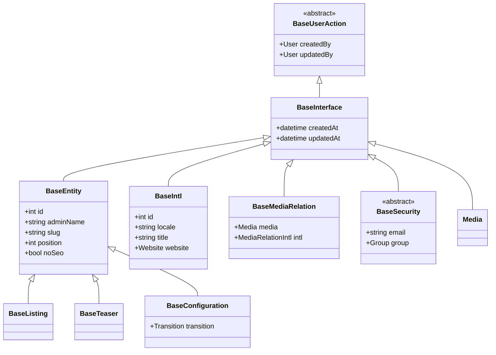
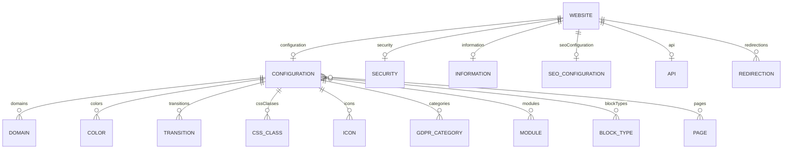
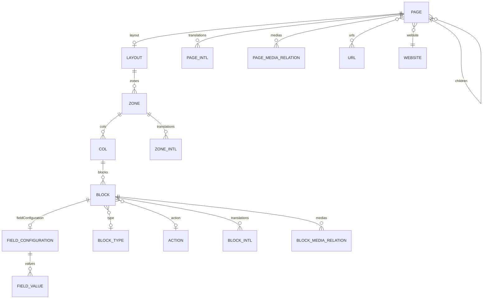
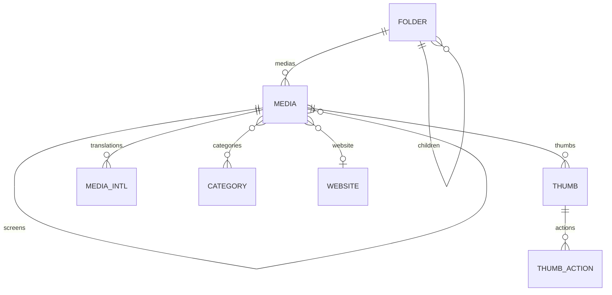
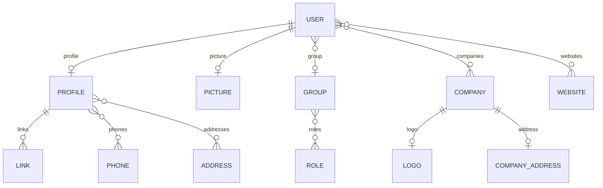
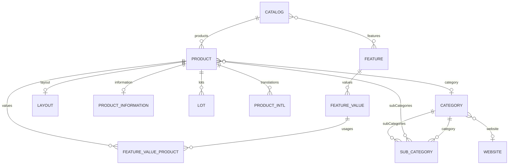
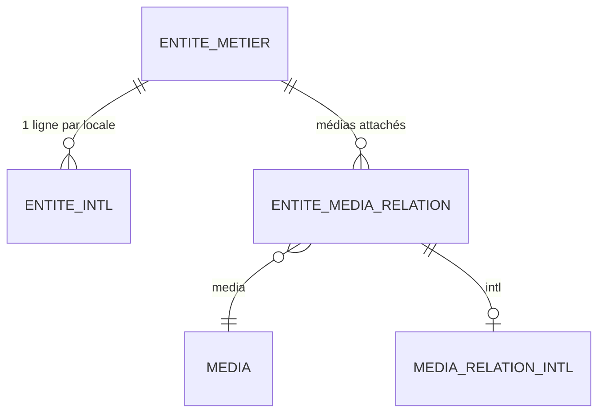

# Modèle de données (schéma)

Schéma relationnel du modèle Doctrine, par domaine fonctionnel, accompagné d'une
lecture critique (risques, pistes d'amélioration, optimisations). Les diagrammes sont
écrits à la main et **curatés** : ils privilégient la lisibilité des relations
structurantes sur l'exhaustivité (le modèle compte plus de 200 entités).

> Convention de lecture des recommandations : **Constat** = fait vérifié dans le code ;
> **Risque** = hypothèse à confirmer (mesure / EXPLAIN) ; **Piste** = proposition
> d'amélioration. Avant toute action, valider avec le skill `doctrine-audit` et un
> `EXPLAIN` sur données réelles.

---

## 1. Hiérarchie des classes de base

Toutes les entités héritent d'une chaîne de `MappedSuperclass` qui factorise l'audit
(`createdBy` / `updatedBy`), l'horodatage (`createdAt` / `updatedAt`) et l'identité
(`id`, `adminName`, `slug`, `position`).

**Lecture critique**

- **Constat** : `createdBy` / `updatedBy` sont des `ManyToOne` vers `User` présents sur
  **toutes** les entités (via `BaseUserAction`). C'est cohérent pour la traçabilité.
- **Risque** : ces deux FK systématiques alourdissent chaque table (deux colonnes +
  index) et chaque hydratation si elles ne sont pas en `EXTRA_LAZY`. Sur les entités
  très volumineuses (`*Intl`, `*MediaRelation`), l'intérêt fonctionnel d'un audit
  `updatedBy` mérite d'être questionné.
- **Piste** : pour les entités purement techniques (traductions, relations média),
  envisager de ne pas hériter de l'audit utilisateur, ou de le rendre `nullable` +
  `EXTRA_LAZY` (déjà le cas pour `createdBy`/`updatedBy`, à confirmer côté requêtes).

---

## 2. Cœur (Core) : Website comme hub

`Website` est le pivot multi-sites. Chaque site porte une `Configuration` et ses
satellites (sécurité, infos, SEO, API) en `OneToOne`, et la `Configuration` agrège les
réglages d'affichage.

**Lecture critique**

- **Constat** : `Configuration` porte une relation `ManyToMany` vers `Page` déclarée
  `cascade: ['persist', 'remove']`.
- **Risque** : un `cascade remove` sur une association `ManyToMany` est inhabituel et
  dangereux. Supprimer / dissocier une `Configuration` peut entraîner la suppression de
  `Page` potentiellement partagées, ou des effets de bord non voulus sur la table de
  jonction. À auditer en priorité.
- **Piste** : restreindre le cascade au strict nécessaire (souvent `persist` seul sur un
  `ManyToMany`) et gérer les suppressions explicitement côté service.
- **Constat** : tous les satellites de `Website` sont en `fetch: 'EXTRA_LAZY'` — bon
  choix, ils ne sont chargés qu'à l'accès.

---

## 3. Layout : la composition d'une page

Le rendu d'une page suit une arborescence profonde. **Le bloc appartient à une colonne
(`Col`), pas directement à la zone** : `Page → Layout → Zone → Col → Block`.

**Lecture critique**

- **Constat** : chaîne d'hydratation très profonde pour afficher **une seule page** :
  `Page → Layout → Zone → Col → Block`, puis pour chaque `Block` ses `BlockIntl`, son
  `FieldConfiguration → FieldValue`, et ses `BlockMediaRelation`.
- **Constat** : `Col::$blocks` et `Block::$blockMediaRelations` sont en `fetch: 'EAGER'`,
  et `BaseMediaRelation::$media` / `$intl` aussi → chaque média de chaque bloc est
  chargé en cascade dès qu'on touche une colonne.
- **Risque** : combinaison `EAGER` + arborescence = explosion du nombre de requêtes /
  du volume hydraté au rendu d'une page riche. C'est le point de performance le plus
  sensible du modèle.
- **Piste** : passer les collections de rendu en `EXTRA_LAZY`, charger explicitement via
  des **fetch joins** ciblés dans le repository de page, et exposer le rendu via des
  **DTO/projections** plutôt que des entités hydratées complètes. Mesurer avant/après
  avec le profiler Doctrine.

---

## 4. Médias

`Media` est auto-référent (un média « parent » et ses déclinaisons d'écran
`mediaScreens`), rangé dans une arborescence de `Folder`, et catégorisé en `ManyToMany`.

**Lecture critique**

- **Constat** : `Media::$thumbs` et `Media::$mediaIntls` sont en `fetch: 'EAGER'`.
- **Risque** : lister des médias (galerie, bibliothèque admin) hydrate
  systématiquement toutes les vignettes et traductions de chaque média, même quand
  l'écran n'en a pas besoin → sur-hydratation et requêtes superflues.
- **Piste** : `EXTRA_LAZY` sur ces collections + fetch join uniquement quand la vue
  affiche réellement vignettes/traductions. Vérifier la présence d'index sur les FK
  `folder_id`, `website_id` et sur `locale` côté `MediaIntl`.
- **Constat** : arbre `Folder` auto-référent — attention aux parcours récursifs non
  bornés côté service (voir synthèse).

---

## 5. Sécurité (utilisateurs & droits)

`User` (back-office) hérite de `BaseSecurity`. Les rôles passent par
`Group → Role` (`ManyToMany`). Le périmètre multi-sites/multi-sociétés est porté par des
`ManyToMany` sur `User`.

**Lecture critique**

- **Constat** : `BaseSecurity::$group` est en `fetch: 'EAGER'`, et `getRoles()` itère
  `group->getRoles()` → les rôles sont résolus à chaque chargement d'utilisateur.
- **Risque** : acceptable pour l'utilisateur courant (1 instance), mais coûteux si on
  liste/charge de nombreux utilisateurs (chaque `User` traîne son `Group` + ses
  `Role`). À surveiller sur les écrans de gestion des comptes.
- **Piste** : conserver `EAGER` sur le `User` authentifié, mais utiliser une projection
  dédiée pour les listes d'utilisateurs. Vérifier l'unicité applicative de `login` /
  `email` (contrainte unique en base + validation).
- **Constat** : périmètre d'accès via `ManyToMany User↔Website` — cohérent avec les
  gardes IDOR multi-website déjà en place. Garder cette relation comme source de vérité
  des contrôles d'accès.

---

## 6. Module représentatif : Catalogue

Exemple d'un module métier (les autres — Agenda, Form, Gallery, Faq, Portfolio, Slider,
Newscast… — suivent les mêmes conventions). `Catalog` est l'instance du module ;
`Product` en est l'entité centrale.

**Lecture critique**

- **Constat** : la valeur d'une caractéristique produit existe sous deux formes
  proches — `FeatureValue` (référentiel) et `FeatureValueProduct` (affectation à un
  produit, table `module_catalog_product_values`). `FeatureValueProduct` charge
  `Feature` **et** `FeatureValue` en `EAGER`.
- **Risque** : redondance potentielle entre `FeatureValue` et `FeatureValueProduct` et
  triple jointure EAGER à chaque accès aux valeurs d'un produit → coûteux sur une fiche
  produit riche ou une liste.
- **Risque (cohérence)** : les `mappedBy` legacy (`catalogfeature`, `catalogcategory`)
  divergent du nom de propriété attendu — purement cosmétique mais source de confusion.
- **Piste** : sur les listes produits, projeter via DTO ; réserver l'hydratation
  complète à la fiche. Indexer les FK `catalog_id`, `category_id`, `product_id`,
  `feature_id`. Mesurer l'intérêt de fusionner les deux notions de « valeur ».

---

## 7. Patterns transverses

Deux conventions se répètent sur quasiment toutes les entités métier.

- **`*Intl`** (`PageIntl`, `BlockIntl`, `ProductIntl`…) : une ligne par locale, héritant
  de `BaseIntl`. Avantage : i18n homogène. **Constat** : `BaseIntl` déclare des index
  `FULLTEXT` sur `title`, `introduction`, `body`, `associatedWords` — utile pour la
  recherche.
- **`*MediaRelation`** (`PageMediaRelation`, `BlockMediaRelation`…) : table de liaison
  enrichie vers `Media`, avec `media` et `intl` en `EAGER`.

**Lecture critique (transverse)**

- **Risque** : le `EAGER` quasi systématique sur `media` / `intl` des relations média
  est le multiplicateur de charge n°1 du modèle dès qu'on liste des contenus.
- **Piste** : auditer chaque collection en `EAGER` et basculer en `EXTRA_LAZY` par
  défaut, avec fetch join à la demande.

---

## Synthèse : pistes d'amélioration & optimisations

| Domaine | Constat (vérifié) | Risque / hypothèse | Piste |
|---|---|---|---|
| Layout (rendu page) | `Col::blocks`, `Block::blockMediaRelations`, `MediaRelation::media/intl` en `EAGER` sur une arbo profonde | Explosion requêtes/hydratation au rendu | `EXTRA_LAZY` + fetch joins ciblés + DTO de rendu |
| Médias (listes) | `Media::thumbs` & `mediaIntls` en `EAGER` | Sur-hydratation des listes/galeries | `EXTRA_LAZY`, projeter les listes |
| Core | `Configuration ↔ Page` ManyToMany `cascade: remove` | Suppression en cascade non maîtrisée | Réduire le cascade, supprimer explicitement |
| Sécurité | `BaseSecurity::group` `EAGER` + `getRoles()` itératif | Coûteux sur listes d'utilisateurs | Projection pour les listes, EAGER réservé au user courant |
| Catalogue | `FeatureValue` vs `FeatureValueProduct` + triple `EAGER` | Redondance + jointures lourdes | Projeter les listes, indexer les FK, questionner la fusion |
| Arbres auto-référents | `Page`, `Block`(via `Col`), `Media`, `Folder`, `MenuItem` | Parcours récursifs non bornés | Borner la profondeur, charger par niveau, cache |
| Audit transverse | `createdBy`/`updatedBy` sur toutes les entités | Surcoût stockage/hydratation sur tables techniques | Exclure l'audit des entités purement techniques |

**Méthode recommandée avant toute optimisation**

1. Lancer le skill `doctrine-audit` sur les repositories de rendu (page, listes).
2. Activer le profiler Doctrine et capturer le nombre de requêtes sur les pages
   réelles les plus lourdes (page riche, liste produits, bibliothèque média).
3. `EXPLAIN` sur les requêtes de liste pour confirmer l'usage des index sur les FK et
   sur `locale` des tables `*Intl`.
4. Traiter en priorité le rendu Layout (gain le plus élevé), puis les listes médias /
   produits.

> Ces pistes sont des **hypothèses de travail** issues d'une lecture statique du mapping.
> Aucune ne doit être appliquée sans mesure préalable ni validation humaine.
